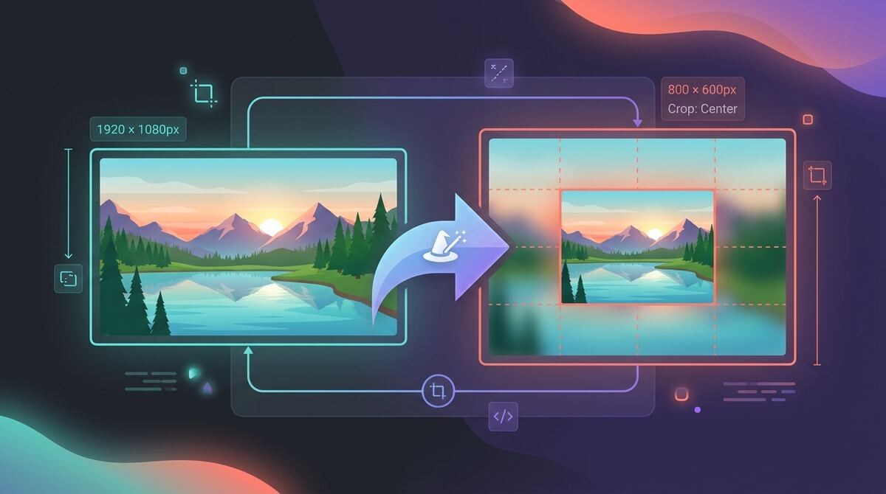

<div align="center">

# 🪄 ImageMagick MCP Server

**Give your AI assistant a pair of hands for image cropping, resizing, and blur-fill backgrounds.**

A tiny, fast [MCP](https://modelcontextprotocol.io) server that wraps [ImageMagick](https://imagemagick.org) so any MCP-aware agent (Claude, Cursor, etc.) can reframe images to exact dimensions — without ever distorting them.



[](https://go.dev)
[](https://imagemagick.org)
[](https://modelcontextprotocol.io)
[](https://roxl.net)

</div>

---

## The problem

You ask your AI assistant to "make this image 1200×630 for the OG card." It can _describe_ the steps, but it can't actually run ImageMagick — so you end up copy-pasting `magick` incantations yourself. And the naive command (`-resize 1200x630!`) **stretches** the image into a squashed mess.

Real-world reframing is annoying because:

- **Aspect ratios never match.** A 4:3 photo into a 16:9 slot leaves ugly gaps — or forces a distorting stretch.
- **Cropping loses content.** Crop-to-fill is clean, but it can chop off the subject.
- **Letterboxing looks dead.** Plain black bars scream "I gave up."
- **The commands are arcane.** `+clone`, `-extent`, `-gravity`, `-composite`… nobody remembers these.

## The solution

One MCP tool — `crop_resize_blur_bg` — that hits exact dimensions while preserving the whole image, picking the right strategy for you:

| Mode | What you get | Best for |
|------|--------------|----------|
| 🌫️ `blur` *(default)* | Image fitted on top of a **blurred, zoomed copy of itself** — fills the gap beautifully, no dead space | Thumbnails, hero cards, social posts |
| ✂️ `cover` | Crop-to-fill, centered — no padding, no bars | Avatars, tiles, fixed-grid galleries |
| 📦 `contain` | Fit inside with clean black padding | Logos, screenshots, art you can't crop |

When the source already matches the target ratio, it just resizes cleanly. No distortion, ever.

> The banner above was generated, then crunched **from 1.4 MB to 61 KB** — by this exact tool.

---

## ⚡ Quick start

```bash
# 1. Build the binary
make build        # → bin/imagemagick-mcp

# 2. Register it with your MCP client (see below)
```

### Register with Claude Code

```bash
claude mcp add imagemagick -- /absolute/path/to/bin/imagemagick-mcp
```

### Register manually (any MCP client)

```json
{
  "mcpServers": {
    "imagemagick": {
      "command": "/absolute/path/to/bin/imagemagick-mcp"
    }
  }
}
```

Then just ask: *"Resize `~/photo.jpg` to 1200×630 and save it to `~/og.jpg`."*

---

## 📋 Requirements

- **Go 1.22+** — to build the server
- **ImageMagick 7** — the `magick` binary must be on your `PATH`

<details>
<summary><b>Installing ImageMagick</b></summary>

**macOS**
```bash
brew install imagemagick
```

**Ubuntu / Debian**
```bash
sudo apt update && sudo apt install imagemagick
```

**Fedora / RHEL / CentOS**
```bash
sudo dnf install imagemagick
```

**Arch Linux**
```bash
sudo pacman -S imagemagick
```

**Windows** — download the installer from [imagemagick.org/script/download.php](https://imagemagick.org/script/download.php) and tick **"Add application directory to your system path"**. Or:
```powershell
choco install imagemagick      # Chocolatey
winget install ImageMagick.ImageMagick   # Winget
```

Verify:
```bash
magick --version
```

</details>

---

## 🛠️ MCP tool: `crop_resize_blur_bg`

Resize/crop an image to exact dimensions. If the aspect ratio differs, choose how the gap is handled with `mode`.

| Parameter | Type | Required | Default | Description |
|-----------|------|----------|---------|-------------|
| `input_path` | string | ✅ | — | Absolute path to the source image |
| `output_path` | string | ✅ | — | Absolute path for the output (parent dirs auto-created) |
| `width` | number | ✅ | — | Target width in pixels |
| `height` | number | ✅ | — | Target height in pixels |
| `mode` | string | — | `blur` | `blur`, `cover`, or `contain` |
| `blur` | number | — | `30` | Blur radius (used by `blur` mode only) |

A second tool, `describe_imagemagick_interface`, returns server metadata for discovery.

---

## 🔧 Makefile targets

| Target | Description |
|--------|-------------|
| `make build` | Build for the current platform → `bin/imagemagick-mcp` |
| `make build-all` | Cross-compile for darwin/linux/windows (amd64 + arm64) |
| `make pack` | Cross-compile + archive into `bin/dist/` |
| `make test` | Run all tests |
| `make install` | Build + copy the binary to `/usr/local/bin` |
| `make clean` | Remove `bin/` |
| `make release` | Bump version, tag, push, pack, and publish a GitHub release (needs `gh`) |

### Release

```bash
make release
```

Interactive — prompts for a `major`, `minor`, or `patch` bump, then tags, pushes, and publishes the GitHub release automatically.

---

<div align="center">

Built with Go + ImageMagick · by [roxl.net](https://roxl.net)

</div>
